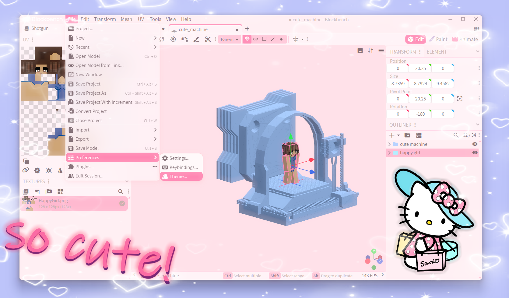

# BEST BLOCKBENCH THEME!!

  

 

it's fully inspired by strawberry milk & sakura seasons! 🍓🥛

### ✨ features
*   **pastel palette:** soft pinks, lavender, and warm whites
*   **glassmorphism:** menus look like frosted glass (so aesthetic!)
*   **cocoa text:** changed the font colors to a warm cocoa brown so it's very cocoa
*   **round everything:** everything is rounded and soft!

---

### ☁️ how to install
it's super easy, don't worry!

1.  download the <a href="https://github.com/shlongee/BLOCKBENCH-CUTE-THEME/releases/download/Tag/cute.bbtheme">cute.bbtheme</a> file from this repo.
2.  open **Blockbench**.
3.  go to **File** -> **Preferences** -> **Theme**.
4.  click **Import Theme** and select the file.
5.  ...and you're done! enjoy the vibes! 💖

#### (or just drag & drop :3)

---

### 🎀 credits
original base by **SirJain** (tysm for the groundwork!).  
pink edit & cozy adjustments by me.

if you use this theme, feel free to tag me or star this repo! ⭐  
happy modeling! xoxo

---
